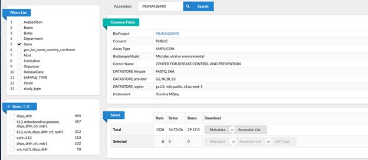
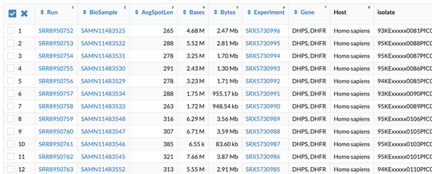
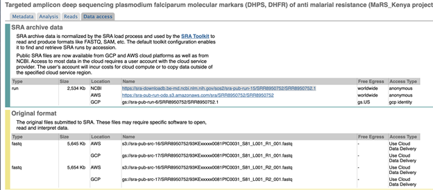

June-2021 Subin Park

# NCBI Run Selector

Our sequence information under BioProject [PRJNA428490](https://www.ncbi.nlm.nih.gov/bioproject/PRJNA428490)

[https://www.ncbi.nlm.nih.gov/Traces/study/?acc=PRJNA428490&amp;o=treatment\_drug\_sam\_s\_dpl55\_s%3Aa%253Bacc\_s%253Bacc\_s%253Bacc\_s%253Bacc\_s%253Bacc\_s%253Bacc\_s%253Bacc\_s%253Bacc\_s%253Bacc\_s%253Bacc\_s%3Bacc\_s%3Aa](https://www.ncbi.nlm.nih.gov/Traces/study/?acc=PRJNA428490&amp;o=treatment_drug_sam_s_dpl55_s%3Aa%253Bacc_s%253Bacc_s%253Bacc_s%253Bacc_s%253Bacc_s%253Bacc_s%253Bacc_s%253Bacc_s%253Bacc_s%253Bacc_s%3Bacc_s%3Aa)

## Filters List(Top left)

Filters for experiment (We do not expect users to use this for filter)

1. AvgSpotLen

- The average "spot length" is expected total length for all reads (its a way to check corresponding data based on kits used) -- internal check that we are not submitting no records or wrong records.
- Since this database includes sequencing data from our DPDM NGS core as well as others, the avg spot length will vary based on sequencing kit used. We most routinely use the 500 cycle kit (250 x 250 read length) and thus most of the data
- Falls into the 250 - 350 range since it considered overlapping reads as well. We also have data for the 150 cycle (75 x 75) and 300 cycle (150 x 150) and 600 cycle (300 x 300).

2. Bases (in Mbp) : Length of sequence
3. Bytes (in M) : Size of file

Filters for location of sequencing

1. Department
2. Institution

Filters for samples of interest (We expect users to use these filters mostly)

1. Gene

    - Genes that were sequenced

2. Geo\_loc\_name\_country\_continent

    - Origin of sequence

3. Study\_type

    - **For PARMA samples** , this column would show as "PARMA (Country) TES study"

**Will be added**

4. Mutation profile (Gene dependent)

    - Column name would be gene and cell will show the type of mutation existed in the sample

5. Recrudescence/Reinfection information
6. Treatment information
7. EpiID

    - EpiID would be added corresponded to "Sample Name"

8. Day

    - Day of treatment failure would be included

Other filters

1. Host
2. Organism
3. Strain
4. SAMPLE\_TYPE: blood, missing, dried blood, whole blood, frozen cells etc

## Explore samples

1. Select filter from "Filters List" and select further filters accordingly

i.e. Select "Gene" -> select gene set of interest

2. You will get most of information of each samples by looking through tables.

To see further information, click ID under "RUN" column

3. If you want to download sequences itself

    a. Through GUI(aka clicking around)
    
    From (2) ID from "RUN", select "Data access" tab and click "https:.." for NCBI 
    
    or AWS
    

     b. Command line

    - From main page, click all samples of your interest and download SRA names by clicking "Accession List"
    - Use fastq-dump(SRA tools), download SRA sequences of accession numbers
    
        [https://ncbi.github.io/sra-tools/fastq-dump.html](https://ncbi.github.io/sra-tools/fastq-dump.html)