# **Targeted Amplicon Deep Sequencing of Plasmodium falciparum (Pf) molecular markers of resistance**

_Preparing full length genes Pf kelch 13 (k13), Pf chloroquine resistant transporter (crt), Pf multidrug resistant protein 1 (mdr1), Pf bifunctional dihydrofolate reductase-thymidylate synthase (dhfr), Pf dihydropteroate synthase (dhps) mitochondrial genome, Pf s47, and Pfcpmp amplicons for sequencing on the Illumina MiSeq system_

• Introduction/General Overview 

• Materials and Equipment 

• NGS Library Preparation Workflow 

• PET PCR Sample QC 

• Gene PCR Enrichment 

• Electrophoresis 

• SequalPrep Normalization and Purification

• Tagment Genomic DNA and Tagmentation Clean-Up 

• Amplification of Tagmented DNA (Index PCR) 

• Library PCR Clean up

• Library Pooling, Quantification, and Normalization 

• Library Denaturing and MiSeq Sample Loading 

• Supporting Information

**IMPORTANT NOTICE**

This document provides information for an application for Illumina technology that has been demonstrated internally and may be of interest to customers. This information is provided as‐is and is not an Illumina product and is not accompanied by any rights or warranties. Customers using or adapting this information should obtain any licenses required and materials from authorized vendors. Illumina products mentioned herein are for research use only unless marked otherwise. While customer feedback is welcomed, this application is not supported by Illumina Technical Support and Field Application Scientists.

October 2nd, 2021 version 4.0 modified by Eldin Talundzic ([etalundzic@cdc.gov)](mailto:etalundzic@cdc.gov))

This protocol format was adapted from the 16S Metagenomics Sequencing Library Preparation [protocol](http://support.illumina.com/documents/documentation/chemistry_documentation/16s/16s-metagenomic-library-prep-guide-15044223-b.pdf) from Illumina, and the [Illlumina DNA Prep Reference Guide](https://support.illumina.com/content/dam/illumina-support/documents/documentation/chemistry_documentation/illumina_prep/illumina-dna-prep-reference-guide-1000000025416-09.pdf).

## **Introduction and General Workflow**

Human malaria is caused by four parasite species called _Plasmodium falciparum (Pf), P. vivax (Pv), P. ovale (Po)_ and _P. malariae (Pm)._ Two of these, _Pf_ and _Pv,_ pose the greatest threat to global public health. About 3.2 billion people, half of the world's population, are at risk for malaria. In 2015, 95 nations had ongoing malaria transmission and annually 198 million people suffer from malaria, causing an estimated 438,000 deaths. In the U.S., an estimated 1,500 - 2,000 cases of malaria are imported annually. One of the greatest public health challenges for malaria control and elimination is the threat of drug resistant _Pf_ parasites.

Our previously effective anti-malarial treatments, chloroquine (CQ) and sulfadoxine/pyrimethamine (SP), are ineffective in many regions. Even more alarming, resistance to our last effective class of anti-malarial drugs, called artemisinins, has now emerged and spread in Southeast Asia — threatening malaria control and prevention programs globally.

Identifying and tracking drug resistance are critical for providing appropriate malaria prophylaxis and treatment guidelines. Molecular markers of resistance are available for several anti-malarial drugs, including artemisinins. Surveillance using molecular markers provides a robust system for the detection and tracking of resistant malaria parasites.

Below is a table of the major molecular markers and their respective amino acid polymorphisms that are associated with resistance to various anti-malarial treatments.

### **Table 1** Molecular Markers and amino acid polymorphisms

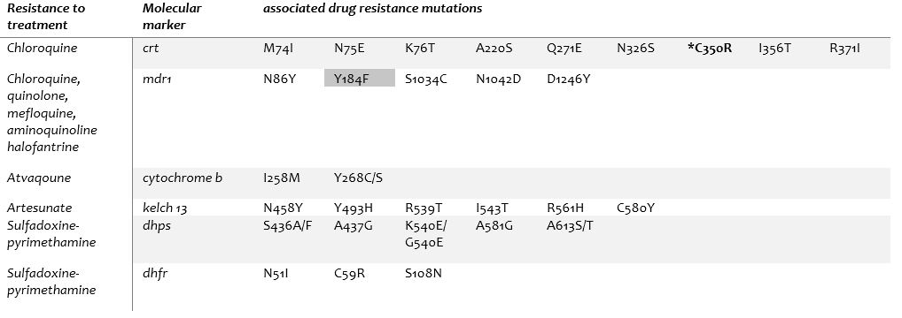

**\*C350R** _results in a reduction of chloroquine resistance._

The method described in this SOP provides an integrated advanced molecular detection system for drug resistance surveillance of all currently known anti-malarial treatments. This technology is based on a next generation sequencing (NGS) protocol referred to as targeted amplicon deep sequencing (TADS).

## **Material and Equipment**

Please ensure all the necessary user‐supplied consumables and equipment are available before proceeding to sample preparation.

### **Table 2** User‐Supplied Consumables

| Consumable | Supplier |
| --- | --- |
| **Non-powdered sterile gloves** | General lab supplier |
| **Laboratory coat** | General lab supplier |
| **1.7ml microcentrifuge tubes** | General lab supplier |
| **10 μl barrier pipette tips** | General lab supplier |
| **10 μl multichannel pipettes** | General lab supplier |
| **10 μl single channel pipettes** | General lab supplier |
| **20 μl barrier pipette tips** | General lab supplier |
| **20 μl multichannel pipettes** | General lab supplier |
| **20 μl single channel pipettes** | General lab supplier |
| **200 μl barrier pipette tips** | General lab supplier |
| **200 μl multichannel pipettes** | General lab supplier |
| **200 μl single channel pipettes** | General lab supplier |
| **1000 μl barrier pipette tips** | General lab supplier |
| **1000 μl multichannel pipettes** | General lab supplier |
| **1000 μl single channel pipettes** | General lab supplier |
| **PCR grade water** | General lab supplier |
| **RNase/DNase‐free 8‐well PCR strip tubes and caps** | General lab supplier |
| **[Optional] Disposable Polystyrene Reservoirs** | General lab supplier (Thomas Scientific Cat # 55501080) |
| **2X ABI TaqMan environmental buffer w/ Rox dye** | Applied Biosystems Catalog # 4396838 |
| **Strip tubes 8X** | Agilent Catalog #410022 |
| **Strip Optical caps 8X** | Agilent Catalog #410024 |
| **Hardshell® 96‐well PCR Plates, clear semi skirted** | Bio-Rad Catalog # HSS9601 |
| **Phusion® High-Fidelity DNA Polymerase** | NEB Catalog # M0530L |
| **Deoxynucleotide (dNTP) Solution Mix** | NEB Catalog #N0447L |
| **Amplicon PCR Forward Primer (Standard desalting)** | (See tables 2-7) |
| **Amplicon PCR Reverse Primer (Standard desalting)** | (See tables 2-7) |
| **Lonza SeaKem® LE Agarose** | Lonza Catalog # 50004 |
| **Nucleic Acid gel stain** | Biotum GelRed™ Nucleic Acid Gel Stain |
| **DNA gel loading dye** | Yakva Scientific 6X Orange-G Gel Loading Buffer #YSG |
| **Quick-Load 1kb DNA ladder** | NEB Catalog # N0468 |
| **UltraPure™ 10X TBE Buffer** | Fisher Scientific Catalog #15581-044 |
| **SequalPrepTMNormalization Plate Kit, 96-well** | ThermoFisher Scientific Catalog # A1051001 |
| **Illumina DNA Prep library kit** | Illumina, Cat# 20018705 (96 samples), or # 20018704 (24 samples) |
| **\* Nextera DNA CD Indexes (plate)** | Illumina, Cat # 20018708 (96 samples) or #20018707 (24 samples) |
| **200 Proof Ethanol** | Decon Labs, Inc. Catalog # 2716 |
| **AlumaSeal II aluminum seals** | Excel Scientific, Inc. Cat # AF100 |
| **Clear, 8-strip PCR tubes domed caps** | LabSource, Item # T54-203-CS/10PK MFG# - 321-10-062 |
| **[Optional] 96‐well storage plates, round well, 300 μl****("MIDI" plate)** | Fisher Scientific, part # AB‐0859 |
| **Qubit® dsDNA HS Assay Kit** | Life Technologies Corporation Catalog #Q32854 |
| **Qubit™ Assay Tubes** | Thermo Fisher Scientific Catalog # Q32856 |
| **Agilent High Sensitivity D5000 ScreenTape** | Agilent Technologies, Cat. # 5067-5592 |
| **Agilent High Sensitivity D5000 Reagents** | Agilent Technologies, Cat. # 5067-5593 |
| **Agilent High Sensitivity D5000 Ladder** | Agilent Technologies, Cat. # 5067-5594 |
| **1N NaOH** | Sigma-Aldrich, Inc. Catalog #SX0607H-6 |
| **Tris Hydrochloride, 1M Solution (pH 7.0/Mol. Biol.)** | Thermo Fisher Scientific Catalog #BP1756-100 |
| **MiSeq Reagent Kit V2 500 cycle kit** | Illumina #MS-102-2003 |
| **MiSeq Reagent V2 Nano Kit 500 cycle** | Illumina #MS-103-1003 |

**\* If you plan** **to pool >96 samples, you will need the Index Kit Set A, B, C, and D to provide unique multiplex combinations of indices (cat #'s:** **20027213, 20027214, 20027215, 20027216)**

### **Table 3** User‐Supplied Equipment

| Equipment | Supplier |
| --- | --- |
| **2-8°C Refrigerator** | General lab supplier |
| **-20°C Refrigerator** | General lab supplier |
| **Vortex** | General lab supplier |
| **4x Eppendorf PCR Cooler, iceless cold storage system for 96 well plates and PCR tubes** | Sigma-Aldrich, Inc (Z606634-1EA) |
| **Agilent ABI7500 or equivalent real-time PCR macine** | Agilent Technologies, Cat # 4351106 |
| **96‐well thermal cycler (with heated lid)** | General lab supplier |
| **Electrophoresis rig** | General lab supplier |
| **Magnetic stand‐96 or**  **96S Super Magnet Plate** | Life Technologies, Cat # AM10027 or Alpaqua SKU A001322|
| **Microplate centrifuge** | General lab supplier |
| **Qubit 3.0 Fluorometer (or equivalent)** | Life Technologies Corporation, Cat #Q33216 |
| **Agilent D4200 ScreenTape System (or equivalent)** | Agilent Technologies, Cat # G2991AA |
| **MiSeq Desktop Sequencer**| Illumina Inc. |

## **Protocol Workflow**

**NOTE: The hands-on times are based on using 96-well format plates for each step.**

**PET-PCR Sample Quality Check [Sample QC]**

Real-time PCR hands-on time 30 min / 96 samples; Cycle time 1.2 hours

Reagents: Primers, 2X ABI TaqMan buffer, DNase PCR free water

&nbsp;&nbsp;&nbsp;&nbsp;&nbsp;&nbsp;&nbsp;&nbsp;&nbsp;&nbsp;&nbsp;&nbsp;&nbsp;&nbsp;&nbsp;&nbsp;&nbsp;&nbsp;&nbsp;&nbsp;&nbsp;&nbsp;&nbsp;&nbsp;&nbsp;&nbsp;&nbsp;&nbsp;&nbsp;&nbsp;&nbsp;&nbsp;&nbsp;&nbsp;&nbsp;&nbsp;&nbsp;&nbsp;&nbsp;&nbsp;&nbsp;&nbsp;&nbsp;&nbsp;&nbsp;&nbsp;&nbsp;&nbsp;&nbsp;&nbsp;&nbsp;&nbsp;&nbsp;

**PCR reaction to generate amplicons [Amplification]**

PCR hands-on time 30 min / 96 samples; Cycle time 2.5 hours

Reagents: 10uM Primers, HF Phusion Taq, 5X GC Buffer, 10mM dNTPs, DNase PCR free water

&nbsp;&nbsp;&nbsp;&nbsp;&nbsp;&nbsp;&nbsp;&nbsp;&nbsp;&nbsp;&nbsp;&nbsp;&nbsp;&nbsp;&nbsp;&nbsp;&nbsp;&nbsp;&nbsp;&nbsp;&nbsp;&nbsp;&nbsp;&nbsp;&nbsp;&nbsp;&nbsp;&nbsp;&nbsp;&nbsp;&nbsp;&nbsp;&nbsp;&nbsp;&nbsp;&nbsp;&nbsp;&nbsp;&nbsp;&nbsp;&nbsp;&nbsp;&nbsp;&nbsp;&nbsp;&nbsp;&nbsp;&nbsp;&nbsp;&nbsp;&nbsp;&nbsp;&nbsp;

**Analysis of PCR amplicons [Electrophoresis]**

PCR amplicon electrophoresis hands-on time 10 min / 8 samples; Gel running time 30 min

If <20 samples, run _all samples_ on the gel; If >20 samples, pick _20 samples_ with varying CT values and run on the gel

Reagents: Agarose, DNA loading dye, 1kb DNA ladder, 1X TBE Buffer

&nbsp;&nbsp;&nbsp;&nbsp;&nbsp;&nbsp;&nbsp;&nbsp;&nbsp;&nbsp;&nbsp;&nbsp;&nbsp;&nbsp;&nbsp;&nbsp;&nbsp;&nbsp;&nbsp;&nbsp;&nbsp;&nbsp;&nbsp;&nbsp;&nbsp;&nbsp;&nbsp;&nbsp;&nbsp;&nbsp;&nbsp;&nbsp;&nbsp;&nbsp;&nbsp;&nbsp;&nbsp;&nbsp;&nbsp;&nbsp;&nbsp;&nbsp;&nbsp;&nbsp;&nbsp;&nbsp;&nbsp;&nbsp;&nbsp;&nbsp;&nbsp;&nbsp;&nbsp;

**PCR amplicons clean up [Purification]**

Hands on time 35 min / 96 samples; Total time 90 min / 8 samples

Reagents: SequalPrep Normalization Binding Buffer, SequalPrep Normalization Wash, SequalPrep Normalization Elution Buffer

&nbsp;&nbsp;&nbsp;&nbsp;&nbsp;&nbsp;&nbsp;&nbsp;&nbsp;&nbsp;&nbsp;&nbsp;&nbsp;&nbsp;&nbsp;&nbsp;&nbsp;&nbsp;&nbsp;&nbsp;&nbsp;&nbsp;&nbsp;&nbsp;&nbsp;&nbsp;&nbsp;&nbsp;&nbsp;&nbsp;&nbsp;&nbsp;&nbsp;&nbsp;&nbsp;&nbsp;&nbsp;&nbsp;&nbsp;&nbsp;&nbsp;&nbsp;&nbsp;&nbsp;&nbsp;&nbsp;&nbsp;&nbsp;&nbsp;&nbsp;&nbsp;&nbsp;&nbsp;

Hands on time 30 min / 96 samples; Total time 17 min / 8 samples

Reagents: BLT, TB1, TSB, TWB

_[optional]_ To assess tagmentation, run 1μl sample on Agilent Bioanalyzer 2X and/or TapeStation 2X using High Sensitivity DNA chip

&nbsp;&nbsp;&nbsp;&nbsp;&nbsp;&nbsp;&nbsp;&nbsp;&nbsp;&nbsp;&nbsp;&nbsp;&nbsp;&nbsp;&nbsp;&nbsp;&nbsp;&nbsp;&nbsp;&nbsp;&nbsp;&nbsp;&nbsp;&nbsp;&nbsp;&nbsp;&nbsp;&nbsp;&nbsp;&nbsp;&nbsp;&nbsp;&nbsp;&nbsp;&nbsp;&nbsp;&nbsp;&nbsp;&nbsp;&nbsp;&nbsp;&nbsp;&nbsp;&nbsp;&nbsp;&nbsp;&nbsp;&nbsp;&nbsp;&nbsp;&nbsp;&nbsp;&nbsp;

**Amplification of Tagmented DNA (Index PCR)**

Hands on time 35 min / 96 samples; Cycle time 38 min / 96 samples

Reagents: EPM, Nuclease-free water, Index 1 and 2 primers

&nbsp;&nbsp;&nbsp;&nbsp;&nbsp;&nbsp;&nbsp;&nbsp;&nbsp;&nbsp;&nbsp;&nbsp;&nbsp;&nbsp;&nbsp;&nbsp;&nbsp;&nbsp;&nbsp;&nbsp;&nbsp;&nbsp;&nbsp;&nbsp;&nbsp;&nbsp;&nbsp;&nbsp;&nbsp;&nbsp;&nbsp;&nbsp;&nbsp;&nbsp;&nbsp;&nbsp;&nbsp;&nbsp;&nbsp;&nbsp;&nbsp;&nbsp;&nbsp;&nbsp;&nbsp;&nbsp;&nbsp;&nbsp;&nbsp;&nbsp;&nbsp;&nbsp;&nbsp;

**Library PCR Clean-up [Purification]**

Hands on time 30 min / 96 samples; Total time 40+ min / 96 samples

Reagents: ­­­­­­­­­­­­­­­­SPB, RSB, Nuclease-free water, fresh 80% EtOH

&nbsp;&nbsp;&nbsp;&nbsp;&nbsp;&nbsp;&nbsp;&nbsp;&nbsp;&nbsp;&nbsp;&nbsp;&nbsp;&nbsp;&nbsp;&nbsp;&nbsp;&nbsp;&nbsp;&nbsp;&nbsp;&nbsp;&nbsp;&nbsp;&nbsp;&nbsp;&nbsp;&nbsp;&nbsp;&nbsp;&nbsp;&nbsp;&nbsp;&nbsp;&nbsp;&nbsp;&nbsp;&nbsp;&nbsp;&nbsp;&nbsp;&nbsp;&nbsp;&nbsp;&nbsp;&nbsp;&nbsp;&nbsp;&nbsp;&nbsp;&nbsp;&nbsp;&nbsp;

**Library Pooling, Quantification, and Normalization**

Hands on time 30+ min / 96 samples; Total time 40+ min / 96 samples

Reagents: Sample Buffer, D5000 Ladder, ScreenTape; Qubit dsDNA HS Buffer and Reagent, Standard #1 and #2

&nbsp;&nbsp;&nbsp;&nbsp;&nbsp;&nbsp;&nbsp;&nbsp;&nbsp;&nbsp;&nbsp;&nbsp;&nbsp;&nbsp;&nbsp;&nbsp;&nbsp;&nbsp;&nbsp;&nbsp;&nbsp;&nbsp;&nbsp;&nbsp;&nbsp;&nbsp;&nbsp;&nbsp;&nbsp;&nbsp;&nbsp;&nbsp;&nbsp;&nbsp;&nbsp;&nbsp;&nbsp;&nbsp;&nbsp;&nbsp;&nbsp;&nbsp;&nbsp;&nbsp;&nbsp;&nbsp;&nbsp;&nbsp;&nbsp;&nbsp;&nbsp;&nbsp;&nbsp;

**Library Denaturing and MiSeq Sample Loading**

Hands on time 30 min / pooled samples; Total time 30 min / pooled samples

Reagents: Resuspension Buffer, HT1, 0.2N NaOH, PhiX Control Kit v3, 200mM Tris-HCl pH7.0

&nbsp;&nbsp;&nbsp;&nbsp;&nbsp;&nbsp;&nbsp;&nbsp;&nbsp;&nbsp;&nbsp;&nbsp;&nbsp;&nbsp;&nbsp;&nbsp;&nbsp;&nbsp;&nbsp;&nbsp;&nbsp;&nbsp;&nbsp;&nbsp;&nbsp;&nbsp;&nbsp;&nbsp;&nbsp;&nbsp;&nbsp;&nbsp;&nbsp;&nbsp;&nbsp;&nbsp;&nbsp;&nbsp;&nbsp;&nbsp;&nbsp;&nbsp;&nbsp;&nbsp;&nbsp;&nbsp;&nbsp;&nbsp;&nbsp;&nbsp;&nbsp;&nbsp;&nbsp;

**Analysis of NGS data [Analysis]**
Hands on time 5 min / 96 samples; Total time 15-25 min / 96 samples
Method: MaRS analysis pipeline

&nbsp;&nbsp;&nbsp;&nbsp;&nbsp;&nbsp;&nbsp;&nbsp;&nbsp;&nbsp;&nbsp;&nbsp;&nbsp;&nbsp;&nbsp;&nbsp;&nbsp;&nbsp;&nbsp;&nbsp;&nbsp;&nbsp;&nbsp;&nbsp;&nbsp;&nbsp;&nbsp;&nbsp;&nbsp;&nbsp;&nbsp;&nbsp;&nbsp;&nbsp;&nbsp;&nbsp;&nbsp;&nbsp;&nbsp;&nbsp;&nbsp;&nbsp;&nbsp;&nbsp;&nbsp;&nbsp;&nbsp;&nbsp;&nbsp;&nbsp;&nbsp;&nbsp;&nbsp;

Standardized SNPs reports generated

## **PET-PCR Sample QC**

This step uses a real time PCR assay to assess the quality and quantity of starting DNA material. The readout includes an estimation of _all_ DNA in the sample, host and parasite.

**NOTE** : This assay is used to identify which samples should be included and/or excluded for downstream procedures. Any sample with a CT value greater than 34, should be excluded. We recommend grouping all samples with a CT > 34 and performing separate amplicon PCRs and electrophoresis for these samples. If the electrophoresis yields positive results (e.g. positive and clear bands on gel) you may procced with downstream procedures. Samples with a CT > 34 have either very low and/or no parasite DNA.

### Consumables

**Table 4. PET-PCR Consumables**

| Item | Quantity | Storage |
| --- | --- | --- |
| **Primers – FAM labled genus primers and HEX labeled _falciparum_ primers (see below)** | 0.25-0.5 μl per sample | 2° to 8°C |
| **TaqMan 2X Environmental buffer** | 10 μl per sample | 2° to 8°C |
| **Nuclease-free water** | 6.25 μl per sample | Room temperature |
| **Strip tubes 8X** | Up to 8 samples per strip | Room temperature |
| **Strip Optical caps 8X** | Up to 8 samples per strip | Room temperature |

### Preparation

• All stock primers should be prepared at a 10μM concentration.

• DNA samples should be stored at 4C until testing or -20C for long term storage.

• Store all primer stocks at -20C for up to 1 year.

• Unopened tubes of ABI TaqMan Environmental Buffer should be stored at -20C for a maximum of six months. Once thawed, store at 4C for up to six months. The reagent must be used within the expiration date provided by the manufacturer.

• All samples should be tested in duplicates or triplicates in some special cases (e.g. very low density situations).

• Typically, the genus/_P. falciparum_ multiplex assay should be run first on all samples. All genus-positive sample are subsequently tested for _P. ovale, P. malaria_ and _P. vivax_, in order to determine the species.

### Procedure

#### **Initial Set up**

- The PET-PCR reaction mix is prepared by mixing the TaqMan environmental buffer, primers, and water as shown below.
- Determine the number of reactions you need to run by multiplying the total number of samples you have to test (including your positive and negative controls) by two because every sample will be tested in duplicates.
  - For example, if you are testing 10 samples, you will multiple this by two to give you 20. Add two extra reactions to account for loss of solution during pipetting. This gives you a total number of 22 reactions. Multiply this number with the volumes below for each component to give you the total master-mix volume required for your experiment.
- In a 1.5mL tube, prepare your master-mix by multiplying the volumes shown below with the total number of reactions you need to run (e.g. 22 as described above).

#### Primers and PCR Conditions

The table below shows the primers and PCR conditions for a multiplex reaction- Genus and P. falciparum:

##### **Table 5. _Multiplexing genus and P. falciparum species specific primers_** 
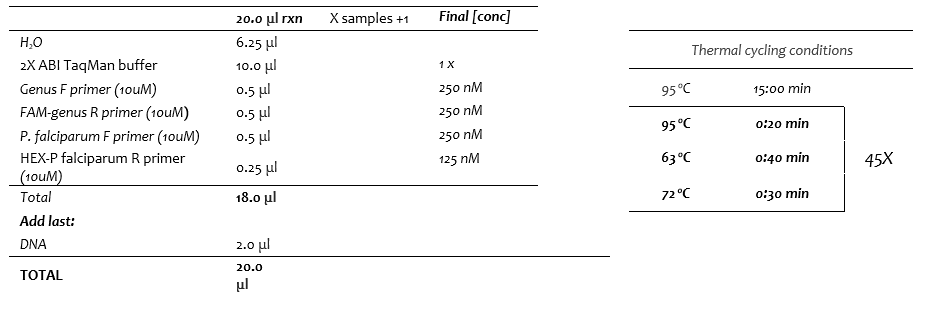
**Primers:**

**Genus 18sFor (5' to 3')** : 5' -GGC CTA ACA TGG CTA TGA CG-3'

**Genus 18sRev (5' to 3'):** 5' -agg cgc ata gcg cct ggC TGC CTT CCT TAG ATG TGG TAG CT-3' (**FAM-labeled: based on the 18s rRNA gene)**

_**P. falciparum**_ **For (5' to 3'):** 5'-ACC CCT CGC CTG GTG TTT TT-3'

_**P. falciparum**_ **Rev (5' to 3'):** 5'-agg cgg ata ccg cct ggT CGG GCC CCA AAA ATA GGA A-3' **(HEX-labeled: based on the r364 target)**

#### **Adding the DNA Samples**

1. Mix the prepared master-mix well by vortexing briefly.
2. Centrifuge the tubes for 5 seconds to remove any solution trapped in the cap.
3. Arrange the optically clear PCR tubes on a PCR-tube rack following the PCR sample sheet. Add 18 μL of the PET-PCR master mix prepared above to each PCR well. Loosely put on the lids of the wells filled with master mix solution.
4. Return all reagents to the freezer and refrigerator before proceeding to the next step.
5. Take the assembled plate containing the tubes with PCR master mix solution to the PCR template area.
6. Add 2 μL of the unknown DNA samples to the wells with the master-mix according to the sample sheet. Cap the well tightly after adding the sample. The total volume of PCR reaction is 20.0 μL after addition of the template.
7. Add positive control DNA to each positive control well with master-mix. Cap the wells after each positive control is added.
8. Add 2.0 μL of DNase-free H2O to the wells designated as the no-template control (NTC) and close that well tightly.
9. Make sure each sample has been added to the correct well and that all wells are tightly capped.
10. Briefly centrifuge your strip tubes to remove any solution trapped on the walls of the wells.
11. Make sure there are no bubbles in the well.

**NOTE:** _The amount of template DNA to be used can be as low as 2uL, but it is not uncommon to use 5uL. This can be adjusted appropriately depending on the sample parasitemia. The change should be discussed before it is implemented._

#### **PCR-Cycling Parameters**

1. Start the real-time PCR thermocycler according to the manufacturer's guidelines.
2. Program the software to detect fluorescence through FAM, HEX and ROX filters all wells. ROX is to be detected as a reference dye.
3. Program the software to run the cycling conditions shown on page under table 5.
4. Fluorescence data should be collected at the amplification plateau.

#### **Interpreting Results**

1. Interpret the results using standard settings in the software.
2. If the calculated thresholds are located within the background noise, they should be manually set to a level slightly higher than the background. Such alterations should be done with only one dye displayed at the time.
3. Positive specimens are those that yield a fluorescence signal above the threshold value in the wells where samples or controls were loaded
  1. Positive PCR: A positive sample produces a fluorescence signal above the threshold/noise level. Positive samples are designated a Ct value below 40.0.
  2. Negative PCR: No fluorescence signal above the threshold/noise level. Negative samples have no Ct or have a Ct value above 40.0.

**NOTE:** _The negative controls must be negative (no Ct or above 40.0). The positive controls must be positive (designated by Ct value below 40.0). The test should be repeated if the NTC has a positive Ct value, or if the positive control yields no positive results._

**For more information, please see:**
Lucchi, N.W., et al., _Molecular diagnosis of malaria by photo-induced electron transfer fluorogenic primers: PET-PCR._ PLoS One, 2013. **8** (2): p. e56677.

## **Gene PCR Enrichment**

This step uses PCR to amplify template from a DNA sample using region of interest-specific primers.

User‐defined forward and reverse primers are used to amplify templates from genomic DNA. A subsequent limited‐cycle amplification step is performed to add multiplexing indices and Illumina sequencing adapters. Libraries are normalized and pooled, and sequenced on the MiSeq system using v2 reagents.

### Procedure

#### **Initial Set up**

- Ensure that the No-DNA and DNA-only UV stations have all the appropriate pipettes and tip sizes.
- Clean up all pipettes and lab bench area using using 10% bleach followed by 70% ethanol.
- Turn on the No-DNA (PCR master mix) and DNA-only UV station for 30 minutes.
- If you have not already done so, create a 10uM working stock solution of your primers, using C1V1 = C2V2 to calculate the appropriate volume needed to make a working stock solution.
- Label all freshly made and newly opened items with the date and your name initials.
- Get the appropriate number of PCR plates and/or PCR tubes and place them in the no-DNA UV station.
- Label the PCR tubes (use a printout template for PCR plates) with sample IDs.
- Get the appropriate number EppendorfPCR Cooler plates from the freezer, wipe down with 70% ethanol and place them in the UV hoods (one or more sets each in the no-DNA and DNA-only UV stations). Turn on the UV stations for another 30 min.
- Be sure to reserve the appropriate number of thermocyclers and have the appropriate cycling conditions set up **(Table 6)**.

#### **Step by step procedure**

- Let Primers, dNTPs, and GC Buffer defrost at room temperature (10-15 min). Once defrosted, mix gently _(vortexed)_ and centrifuge briefly prior to use. **_DO NOT thaw and/or vortex or mix the HF Taq._**
- All PCR reactions **must be assembled on the** Eppendorf PCR Cooler plates
- **Always add the Taq last when making your master mix and DO NOT vortex and/or pipette after adding Taq.**
- If you forget to return any of the reagents, especially the Taq, to its appropriate storage conditions (i.e., leave it out at room temperature), record the date and time of when it happened, and discard.

**1** Set up the following reaction of water, GC Buffer, dNTPs, primers, HF Taq Phusion, and DNA in the order given in **Tables 6.1 – 6.6:**

- Calculate appropriate volumes for mastermix based on number of samples to be included in reaction; multiply each reagent volume times the total number of samples + 1 (for user pipetting errors)
- Final volume of master mix is given in **Tables 6.1 - 6.6**

**NOTE:**  _If the number of samples is \&lt;5, make a mastermix for at least 6 samples to avoid pipetting volume errors._

**2** Seal plates and/or PCR tubes.

**3** Once tubes and/or plates are sealed, keep them in the EppendorfPCR Cooler plates. **Pre-heat** the thermal cycler to 98C prior to placing PCR plates and/or PCR tubes into the thermal cycler. Pre-heating to 98C should take 0:30 of the 3:00 min.

#### Primers and PCR Conditions

The tables below show primers and PCR conditions for _Pfcrt (6.1), Pfk13 (6.2), Mitochondrial genome (6.3), Pfcytb (6.3a), Pfdhps (6.4), Pfdhfr (6.5), Pfmdr1 (6.6), Pfs47(6.7), and Pfcpmp (6.8)_

##### **Table 6.1  _Pfcrt_** 
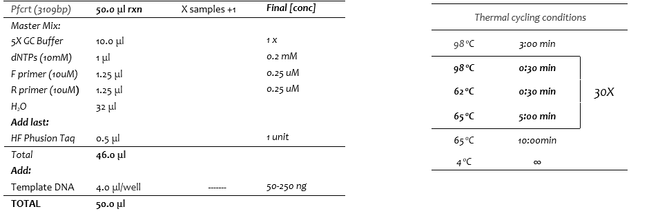

**Primers:  Pfcrt_F1 Sequence (5' to 3'):** _TTACATATAACAAAATGAAATTCGC_ **; Pfcrt_R1 Sequence (5' to 3'):** _TATTGTGTAATAATTGAATCGACG_
##### **Table 6.2  _Pfk13_**
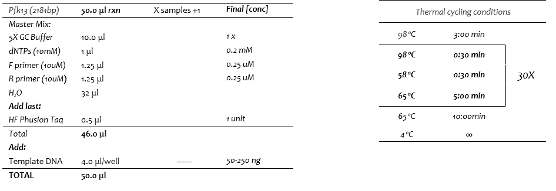

**Primers:  Pfk13_F1_ETn2 Sequence (5' to 3'):** _CTATGACGTATGATAGGGAATCTGG_ **; Pfk13_R1_ETn2 Sequence (5' to 3'):** _CTGGGAACTAATAAAGATGGGCC_

##### **Table 6.3 _Mitochondrial genome_**
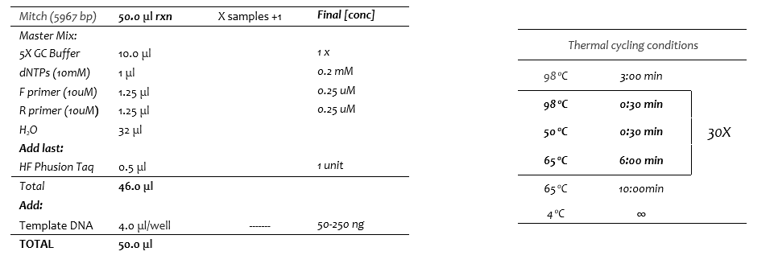

**Primers:  Mitochondrion_F1 Sequence (5’ to 3’):** _AAGCTTTTGGTATCTCGTAAT_ **; Mitochondrion_R1 Sequence (5’ to 3’):** _TATTATAATATAACTCTACAAAGTTGAAC_

NOTE: If experiencing issues with amplifying the full-length mitochondrial genome, consider amplifying only the _cyt-b_ gene instead for characterizing molecular markers associated with Malarone (atovaquone/proguanil) resistance. See Table 6.3a below.

##### **Table 6.3a _Cytochrome b_**
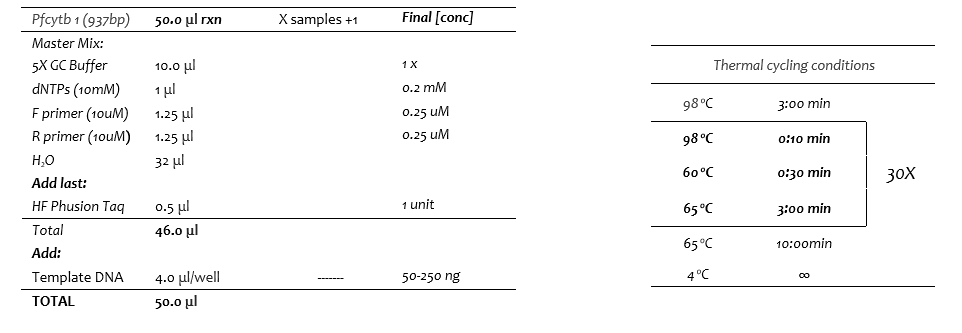

**Primers:  CytB_F1_Sequence (5' to 3'):** _CTATTAATTTAGTTAAAGCACAC_ **; CytB_R1_Sequence (5' to 3'):** _ACAGAATAATCTCTAGCACCA_

##### **Table 6.4 _mdr1_**

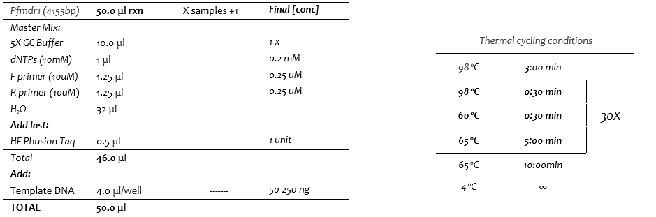

**Primers:  Pfmdr1_F1_Sequence (5' to 3'):** _TGGTAACCTCAGTATCAAAG_ **; Pfmdr1_R1_Sequence (5' to 3'):** _CATCTTGTGCTGATAATAATTC_

##### **Table 6.5 _dhfr_**

**Primers:  Pfdhfr_F1 Sequence (5' to 3'):** _TTTTTACTAGCCATTTTTGTATTCC_ **; Pfdhfr_R1 Sequence (5' to 3'):** _TTAACCGTTCAGGTAATTTTGTCA_

**\*Primers adapted from: SC, Carlton JM.** 2016. A Method for Amplicon Deep Sequencing of Drug Resistance Genes in Plasmodium falciparum Clinical Isolates from India. J Clin Microbiol 54:1500–1511.

##### **Table 6.6 _dhps_**
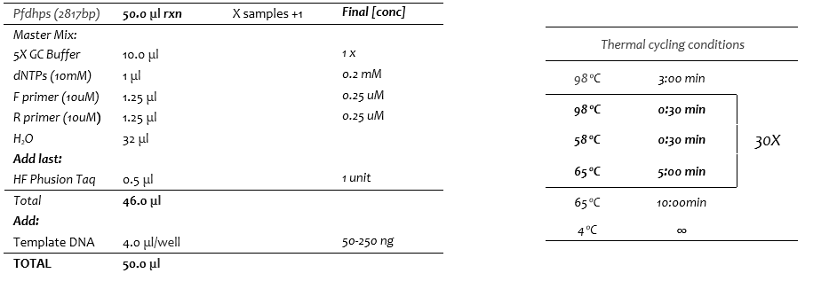

**Primers:  Pfdhps_F Sequence (5' to 3'):** _AATATTTGCGCCAAACTTTTTA_ **; Pfdhps_R Sequence (5' to 3'):** *TTTATTTCGTAATAGTCCACTTTTGAT*

**\*Primers adapted from: SC, Carlton JM**. 2016. A Method for Amplicon Deep Sequencing of Drug Resistance Genes in Plasmodium falciparum Clinical Isolates from India. J Clin Microbiol 54:1500–1511.

##### **Table 6.7 _Pfs47_**
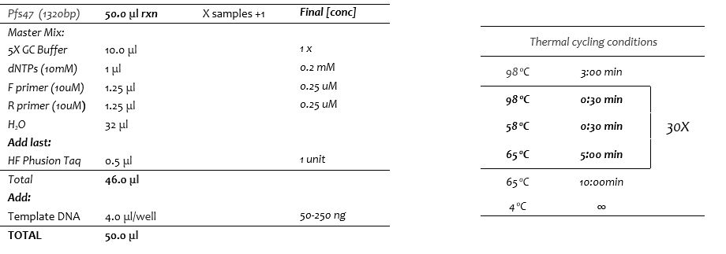

**Primers:  Pfs47_F Sequence (5' to 3'):** *ATGTGTATGGGAAGAATGATCAG* **; Pfs47_R Sequence (5' to 3'):**  *TCATATGCTAACATACATGTAAAAAATTAC*

**SAFE STOPPING POINT** If you do not immediately proceed to Electrophoresis, seal plate with adhesive seal and store it at 2° to 8°C for up to a week.

##### Table 6.8 *Pfcpmp*
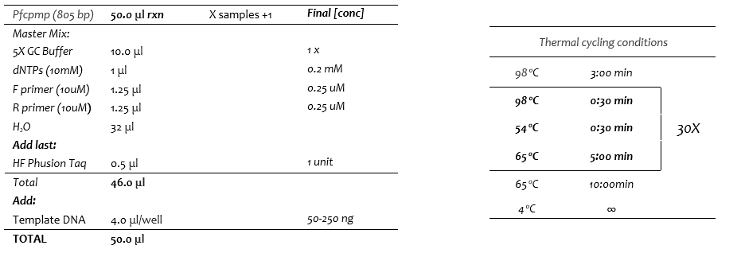

**Primers:  Pfcpmp_F Sequence (5' to 3'):** *GTCATTAAAATTTATGGATTATATATGG* **; Pfcpmp_R Sequence (5' to 3'):** *GTTACTATCCAAGATCGTTAATATC*

### **Electrophoresis**

This step is necessary to ensure successful amplification of amplicons. It is recommended to run at least 25% of the total samples, all no-template and negative controls on the gel to confirm amplification was successful and no contamination occured. Please note PCR amplification can be affected by numerous factors, including but not limited to, DNA quality and quantity.

#### Consumables

**Table 7.**  **Electrophoresis Consumables**

| Item | Quantity | Storage |
| --- | --- | --- |
| **Agarose** | 1g (for a 1% gel) | Room temperature |
| **1x solution of 10X TBE Buffer and deionized water** | 100mL (for a 1% gel) | Room temperature |
| **Nucleic Acid Gel Stain** | 5 μl per 100mL of buffer | Room temperature |
| **Orange Dye** | 2 μl per 8 μl PCR product | Room temperature |

#### Preparation

• Create a 1X solution of 10X TBE Buffer and deionized water before you start.

#### Procedure

**1** Choose an Erlenmeyer flask that is 2-4 times the volume of the solution and place a stirring rod into the flask.

**2** Weigh the agar to the desired concentration

**-** For a 1% agarose gel, 1.0 gram of agarose + 100mL of buffer will fill a medium gel chamber

**-** For a 1.5% agarose gel, 1.5 gram of agarose + 100mL of buffer will fill a medium gel chamber

**3** Add the appropriate amount of buffer for the desired concentration.

**4** Dissolve the agar in the microwave by heating the solution on high power until it comes to a boil. Watch the solution closely; **DO NOT** allow solution to boil over.

**5** Remove the flask with pot holders and gently swirl to re-suspend any settled agar.

**6** Repeat steps 4-5 until all the agar is dissolved (no transparent agarose clumps should be present).

**7** Allow the solution to cool on a stirring plate until you can comfortably hold the flask with your hands.

**8** Using a 10 μlpipette, add nucleic acid gel stain to the solution. For every 100mL of buffer, add 5 μl of gel stain. Swirl solution to mix, making sure as little bubbles as possible are created.

**9** Pour the cooled solution into the gel form- ensure no bubbles are present. Place the comb into the gel and allow the gel to sit undisturbed for at least 15 minutes or until the gel has become firm (the color will change from clear to slightly milky in color).

**10** When gel has solidified, ensure the wells are aligned with the black (negative) nodes on the electrophoresis chamber and fill with buffer until it covers about a centimeter above the gel. Remove the comb.

**11** Combine a mixture of 2 μl of orange dye and 8 μl of each sample and load 8uL of that mixture into each well.

**12** Be sure to include reference ladders (no orange dye necessary).

**13** Place the lid on the chamber box and connect the black node to the negative terminal and the red node to the positive terminal. Turn on the power supply and adjust the voltage to 100-130 volts.

**14** Run gel for about 45 minutes -until the samples nearly reach the end of the gel. **DO NOT** allow samples to run off the gel.

**15** Turn off the power supply, disconnect the electrodes, and remove the lid.

**16** Remove the gel from the chamber and take to the gel reading station for analysis.

**17** Once amplification is confirmed, proceed to SequalPrep Normalization ( **page 16-17** ).

**Clean-Up: SequalPrep Normalization**

### SequalPrep Normalization

This step utilizes ChargeSwitch Technology to purify and normalize amplicon PCR product. PCR product is added to the plate and mixed with Binding Buffer, which then sits at room temperature for 1 hour. The DNA is then washed and eluted, resulting in a purified and normalized DNA product.

This protocol format was adapted from the SequalPrep™ Normalization Plate (96) Kit [protocol](https://www.thermofisher.com/order/catalog/product/A1051001) from ThermoFisher Scientific.

#### Consumables

**Table 8.**  **PCR Purification 1 SequalPrep Consumables**

| Item | Quantity | Storage |
| --- | --- | --- |
| **SequalPrep™Normalization Plate (96)** | 1 plate | 15° to 30°C (Room temperature) |
| **SequalPrep™Normalization Binding Buffer** | 1 μl per 1 μl of sample | 15° to 30°C (Room temperature) |
| **SequalPrep™Normalization Wash Buffer** | 50 μl per sample | 15° to 30°C (Room temperature) |
| **SequalPrep™Normalization Elution Buffer (10mM Tris-HCL, pH 8.5)** | 20 μl per sample | 15° to 30°C (Room temperature) |
| **(Optional) Foil Tape** | 2 sheets | 15° to 30°C (Room temperature) |

#### Preparation

• You will need at least 250 ng amplicon per well to use with the SequalPrep™ Normalization Plate to achieve robust normalization. An average efficiency PCR (20ul reaction volume) produces in the range of 25-100ng/ul, allowing you to purify using 5-10ul using the SequalPrep system.

• This laboratory utilizes the remaining 42ul to ensure the full 250ng concentration.

• Elution options:

- The **standard elution** method (described below) is designed to elute purified DNA from each well using 20 μl elution volume to obtain each amplicon at a concentration of 1–2 ng/μl.
- The **optional sequential elution** method is designed to sequentially elute multiple rows or columns using the same 20 μl of elution buffer to obtain higher amplicon concentrations. The amplicon concentrations will be additive as sequential wells are eluted. For example, dispense 20 μl of elution buffer into the first column (A1–H1), mix well, and incubate for 5 minutes at room temperature. Then, simply move this column of elution buffer to the next column (A2–H2), and again incubate for 5 minutes. Continue this step to obtain your specific elution needs for the downstream application of choice.

**NOTE** : Proceed very cautiously during this procedure and take your time- do not introduce bubbles when pipetting.

#### Procedure

##### **Binding Step**

**1** Transfer the desired volume of PCR product (5–25 μl PCR reaction mix, at least 250 ng amplicon/well) from the PCR plate into the wells of the SequalPrep™ Normalization plate.

**2** Add an equivalent volume of SequalPrep™ Normalization Binding Buffer.

For example: this laboratory utilizes the remaining 42μl of PCR product, to which 42μl of SequalPrep™ Normalization Binding Buffer should be added.

**3** Mix completely by pipetting up and down 10 times, or seal the plate with Foil Tape, vortex to mix, and briefly centrifuge the plate.

**4** Incubate the plate for 1 hour at room temperature to allow binding of DNA to the plate surface. Mixing is not necessary at this stage.

**NOTE:** Incubations longer than 60 minutes do not improve results. However, depending on your work flow you may perform overnight incubation at room temperature for the binding step.

**5** Optional: If 25 ng DNA/well yield is desired, transfer the amplicon/Binding Buffer mixture from Step 4 to another, fresh well/plate to sequentially bind more DNA. Perform DNA binding at room temperature for 1 hour.

**NOTE:** After binding is complete, you can remove the amplicon/Binding Buffer mixture from the well and store at –20ºC for up to 30 days to perform additional purifications at a later time.

##### **Washing Step**

**6** Aspirate the liquid from wells. Be sure not to scrape the well sides during aspiration.

**7** Add 50 μl SequalPrep™ Normalization Wash Buffer to the wells. Mix by pipetting up and down twice to improve removal of contaminants.

**NOTE:** If you wish to store the amplicon/Binding Buffer mixture for additional purifications at a later time, aspirate the liquid from wells into another plate and store at –20ºC for up to 30 days.

**8** Completely aspirate the buffer from wells and discard. To ensure complete removal of wash buffer and maximize elution efficiency, you may need to invert and tap the plate on paper towels depending on the pipetting technique or instrument used. A small amount of residual Wash Buffer (1–3 μl) is typical and does not affect the subsequent elution or downstream applications.

##### **Elution Step**

**9** Add 20 μl SequalPrep™ Normalization Elution Buffer to each well of the plate.

**NOTE:** Do not use water for elution. If you need to elute in any other buffer, be sure to use a buffer of pH 8.5–9.0. If the pH of the buffer is 8.5, the DNA will not elute efficiently.

**10** Mix by pipetting up and down 5 times (or seal the plate with Foil Tape, vortex to mix, and briefly centrifuge the plate). Ensure that the buffer contacts the entire plate coating (up to 20 μl level).

**11** Incubate at room temperature for 5 minutes.

**12** Transfer the normalized and purified DNA to a new 96-well skirted plate. You can store the eluted DNA at 4°C (short-term storage) or –20°C (long-term storage) until further use.

**13** Pool each drug resistance gene (normalized PCR amplicon) as follows:

**- 5uL of each amplicon (**_**i.e. mitochondria/cyt-b, k13, mdr1, dhfr, dhps, and crt)**_ **for each respective sample**

Expected DNA concentration is 1–2 ng/μl when using 20 μl elution volume.

**SAFE STOPPING POINT** If you do not immediately proceed to _Tagment Genomic DNA_, seal plate with Microseal "B" adhesive seal and store it at ‐15° to ‐25°C for up to a week.

### Tagment Genomic DNA and Tagmentation Clean-Up

The tagmentation step uses the Bead-Linked Transposomes (BLT) to tagment DNA. This process fragments and tags the DNA with adapter sequences. The Post Tagmentation Clean up step washes the adapter-tagged DNA on the BLT before PCR amplification.

#### Consumables

**Table 9.**  **Tagment Genomic DNA Consumables**

| Item | Quantity | Storage |
| --- | --- | --- |
| **TB1 (Tagmentation Buffer 1)** | 10 μl per sample | -15° to -25°C |
| **BLT (Bead -Linked Transposome)** | 10 μl per sample | 2° to 8°C |
| **TSB (Tagment Stop Buffer)** | 10 μl per sample | 15°C to 30°C |
| **TWB (Tagment Wash Buffer)** | 300 μl per sample | 15°C to 30°C |
| **1.7mL microcentrifuge tubes** | Varies | Room temperature |
| **96-well 0.2 ml PCR plate** | Varies | Room temperature |
| **Microseal "A" and "B" film** | Varies | Room temperature |

#### Preparation

•If not completed already, **carefully** pool 5uL of each gene's corresponding sample into the same well of a half skirt plate before continuing

•Add appropriate volume of DNA as obtained from gDNA dilution calculator to each well of a 96-well PCR plate so that the total input amount (100 - 1000 ng) is within the desired range. If DNA volume <30 μl, add nuclease-free molecular grade water to the DNA samples to bring the total volume to 30 μl. Add DNA to the molecular-grade water and mix well by gently pipetting approximately 5-10 times

•Vortex BLT for a minimum of 10 seconds and ensure proper suspension of beads, repeat if necessary. Do not centrifuge

• Be sure all samples are mixed thoroughly by pipetting gently 10 times.

• Bring BLT (from refrigerator) and TB1 (from freezer) to room temperature.

**NOTE:** _Ensure that BLT is stored upright at all times, so that the beads remain submerged in the buffer. BLT must be stored at temperatures above 2°C. Do not use BLT that has been stored below 2°C and ensure that it is never frozen._.

•Label a 96-well PCR plate, or equivalent, with Run ID

• Set up thermal cycler and choose preheat lid option:

**_Thermocycler Program: "Flex 1" with reaction volume set to 50ul and choose the preheat lid option set to 100°C_**

     55°C for 15 min

     10°C for ∞

•Check TSB for precipitate (if present, warm at 37°C for up to 10 minutes and vortex) and ensure it is at room temperature

• Set up thermal cycler and choose preheat lid option:

**_Thermocycler Program: "Flex 2" with reaction volume set to 60ul and choose the preheat lid option set to 100°C_**

     37°C for 15 min

     10°C for ∞

#### **Procedure: Tagment Genomic DNA**

**1** Prepare tagmentation mastermix:

| **Reagent** | **Volume (μl) per sample** |
| --- | --- |
| **TB1** | 10 |
| **BLT** | 10 |

**2** Vortex the tagmentation master mix well .

**3** Add 20 μl of master mix to each sample well.

**4** Mix well, resuspending the beads 10 times with multichannel pipet set to 40 μl. **Do not spin the plate.**

**5** Seal the plate with Microseal B (or equivalent) and incubate the plate on the pre-programmed thermal cycler setting "Flex 1"with volume set to 50 μl and lid heated option at 100°C:

      55°C for 15 min

      10°C for ∞

    NOTE: This is not a recommended stopping point in the procedure and post tagmentation clean up should be commenced once the samples have reached 10°C.

#### Procedure: Post Tagmentation Clean-Up

**1** Again, check TSB for precipitate (if present, warm at 37°C for up to 10 minutes and vortex) and ensure it is at room temperature.

**2** Aliquot 12 μl TSB into an 8-tube strip. If there are more than 8 samples, then increase volume accordingly.

**3** Add 10 μl of TSB to each sample with a multichannel pipet.

**4** Pipet gently 10 times to mix and re-suspend the beads using a multichannel pipet set at 40 μl

**5** Seal the plate with Microseal A (or equivalent) and incubate the plate on the pre-programmed thermal cycler setting "Flex 2" with volume set to 60 μl and lid heated option at 100°C:

     37°C for 15 min

     10°C for ∞

    NOTE: This is not a recommended stopping point in the procedure and it is recommended to proceed to the washing steps after samples have reached 10°C.

**6** While samples are incubating, thaw EPM on ice and thaw indices at room temperature.

**7** Aliquot 105 μl of TWB into three wells per samples in a PCR plate.

**8** After incubation, remove from thermal cycler, quick spin the plate, remove microseal, and place on a magnet for 3 minutes until solution is clear (or until beads form a tight pellet).

**9** Using a multichannel pipette set at 100 μl, remove and discard supernatant.

**10** Complete steps **a** - **d** two times:

**a.** Remove the sample plate from the magnetic stand and add 100 μl TWB directly onto the beads.

**b.** Set multichannel pipet to 90 μl and pipette slowly until beads are fully resuspended. If necessary, scrape the side of the well with the pipette tips to resuspend the beads.

**c.** Place the plate on the magnetic stand and wait until the solution is clear (~3 minutes).

**d.** Using a multichannel pipette set at 110 μl, remove and discard supernatant.

**NOTE:** _To minimize the potential of TWB foaming during the tagmentation wash, use a deliberately slow pipetting technique to avoid incorrect volume aspiration and incomplete mixing._

**11** Remove the plate from the magnetic stand and add 100 μl TWB.

**12** Pipette each sample well slowly to resuspend the beads.

**13** Seal the plate and place on the magnetic stand until the solution is clear (~3 minutes). Allow TWB to remain in the wells (to prevent drying of beads) and proceed to amplification steps.

**THIS IS**  **NOT**  **A RECOMMENDED SAFE STOPPING POINT** Please proceed to Ampification of Tagmented DNAon page **20**.

### Amplification of Tagmented DNA (Index PCR)

This step amplifies the tagmented DNA using a limited-cycle PCR program. The PCR step adds Index 1 (i7) adapters, Index 2 (i5) adapters, and sequences required for sequencing cluster generation.

#### Consumables

##### **Table 10.** **Amplification of Tagmented DNA (Index PCR) Consumables**

| Item | Quantity | Storage |
| --- | --- | --- |
| **EPM (Enhanced PCR Mix)** | 20 μl per sample | -15° to -25°C |
| **Index 1 adapters (plate) (Cat# 20018708 (96 samples) or #20018707 (24 samples))** | 10 μl per sample | -15° to -25°C |
| **Nuclease -free water** | 20 μl per sample | Room temperature |
| **1.7mL microcentrifuge tube** | Varies | Room temperature |
| **Microseal "A" film** | Varies | Room temperature |

#### Preparation

•Using the samples suspended in the 100μl of TWB from the Post Tagmentation Clean-Up step (see **page 18-19** ), follow the procedure outlined below

•Set up thermal cycler and choose preheat lid option:

**Thermocycler Program: "Flex 3" with reaction volume set to 50ul and choose the preheat lid option set to 100°C:**

      • 68°C for 3 minutes

      • 98°C for 3 minutes

      • 5 cycles of:

        — 98°C for 45 seconds

       — 62°C for 30 seconds

       — 68°C for 2 minutes

     • 68°C for 1 minute

     • Hold at 10°C

#### Procedure

**1** Briefly vortex the thawed EPM immediately before use.

**2** Prepare the PCR master mix:

| **Reagent** | **Volume (μl) per sample** |
| --- | --- |
| **EPM** | 20 |
| **Molecular grade water** | 20 |

**NOTE:**_It is recommended to increase number of samples during master mix calculation by 1-2 to ensure sufficient master mix volume_.

**3** Vortex and quick spin the PCR master mix.

**4** Aliquot 42 μl of master mix into an 8-tube strip. If there are more than 8 samples, then increase volume accordingly.

**5** Using a multichannel pipette set at 200 μl remove TWB from beads. Use a small volume pipette to ensure removal of residual TWB before proceeding.

**NOTE:**_Removal of TWB is crucial, as it can impede PCR. However, any foam remaining on the wells will not negatively impact the library._

**6** Remove from the magnet and immediately add 40 μl of PCR master mix to each sample.

**7** Using a multichannel pipette set at 30 μl gently pipet to mix, re-suspending the pellet. If necessary, scrape the side of the well with the pipette tips to resuspend the beads

**8** Add 10 μl of appropriate index pair from indices plate to each sample well.

     NOTE: It is recommended to pierce the foil of the desired well on the index plate with a new 200 μl pipet tip, then to use a fresh pipette tip to withdraw the indices from the wells, followed by re- sealing the index plate with a new foil cover (i.e. Microseal F) after each use. 
     
     Make sure that the index is oriented correctly. Handle plate gently to maintain index at the bottom of the plate. If not, spin plate to make sure that index is towards bottom of the plate.

**NOTE:** Index should be added as next available down the columns

**9** Using a multichannel pipette set at 40 μl mix by pipetting a minimum of 10 times.

**10** Seal the plate with Microseal A (or equivalent) and place the plate on the pre-programmed thermal cycler setting "Flex 3" with volume set to 50 μl and lid heated option at 100°C:

    • 68°C for 3 minutes

    • 98°C for 3 minutes

    • 5 cycles of:

      — 98°C for 45 seconds

      — 62°C for 30 seconds

      68°C for 2 minutes

    • 68°C for 1 minute

    • Hold at 10°C

**11** Centrifuge plate for at 280 x g for 1 minute.

**NOTE: This is a safe stopping point. The plate may be sealed with Microseal B or equivalent and stored at 2°C to 8°C for up to 3 days. ** If you choose to continue, please proceed to Library PCR Clean-Up on page 22.

**SAFE STOPPING POINT** If you do not immediately proceed to Library PCR Clean-Up on page **22** _,_ seal plate with an adhesive seal and store it at 2° to 8°C for up to a week.

### Library PCR Clean‐Up

This step uses Sample purification beads to clean up the final library before quantification.

#### Consumables

**Table 11.**  **Library PCR Purification Consumables**

| Item | Quantity | Storage |
| --- | --- | --- |
| **RSB (Resuspension Buffer)** | \_\_ μl per sample | -15° to -25°C (after initial thaw, can keep at 2° to 8°C |
| **SPB (Sample Purification Beads)** | 40.8 μl per sample | 2° to 8°C |
| **Freshly Prepared 80% Ethanol (EtOH)** | 44.2 μl per sample | Room temperature |
| **96‐well 0.2 ml PCR plate** | Varies | Room temperature |
| **Nuclease-free water** | Varies | Room temperature |
| **Microseal 'B' film and 'F' foil** | Varies | Room temperature |
| **96‐well MIDI plate** | Varies | Room temperature |
| **96-well 0.2 ml PCR plate** | Varies | Room temperature |
| **1.7mL microcentrifuge tube** | Varies | Room temperature |

#### Preparation

    •Thaw RSB at room temperature and vortex to mix.

    • Bring the SPB to room temperature- **wait at least 30 minutes**. Once at room temperature, vortex and invert the beads several times to re-suspend any particles that may have settled. Ensure magnetic beads are well (evenly) distributed before adding them to samples.

    NOTE: Proceed very cautiously during this procedure and take your time to ensure as little bubble formation as possible.

    •Prepare a fresh dilution stock of 80% ethanol sufficient for all samples:

| **Reagent** | **Volume (ml) per sample** | **Example: 20 samples** |
| --- | --- | --- |
| **100% ethanol** | 0.4 | 8ml |
| **Molecular grade water** | 0.1 | 2ml |
 |

**NOTE:** 80% ethanol is hygroscopic. That is, when opened the ethanol will both evaporate and absorb water over time. Re-use eventually will be at a lower concentration. There is also miscibility involved with ethanol and water. For example, measuring out 80 mL of ethanol and topping off to 100 mL with water will generate ~65% ethanol. Measuring 80 mL ethanol and 20 mL water separately, then combining them will generate ~95 mL of 80% ethanol. Make sure to use molecular biology grade water (DNAse, RNase and Protease free).

#### Procedure

1. Centrifuge the Library Amplification and Index PCR plate at 280 × g at 20°C for 1 minute to collect condensation, carefully remove seal.

2. Prepare SPB master mix in a 2 mL tube:

| **Reagent** | **Volume (μl) per sample** |
| --- | --- |
| **SPB** | **40.8** |
| **Molecular grade water** | **44.2** |

**NOTE:** _It is recommended to increase the number of samples 3-4 to ensure sufficient volume of master mix._

3. **Place** sample plate on the magnet for 5 minutes (or until beads have formed a tight pellet).

4. Transfer 45 μl of supernatant (now containing the DNA) to new deep well plate.

5. Remove sample plate from the magnet.

6. Vortex SPB master mix thoroughly and aliquot 90 μl per well and add into an 8-tube strip. If there are more than 8 samples, then increase volume accordingly.

7. Using a multichannel pipette mix briefly and add 85 μl of SPB master mix to each sample.

8. Pipet to mix a minimum of 10 times using a multichannel pipet.

**NOTE:** _Use caution when mixing as the volume will be >100 μl._

9. Incubate at room temperature for 5 minutes **.**

10. Place on the magnet for 3-5 minutes (or until beads form a tight pellet).

11. During incubation re-vortex the stock SPB and aliquot 20 μl into an 8-tube strip. If there are more than 8 samples, then increase volume accordingly.

12. After incubation, with the plate still on the magnet, transfer 105 μl of supernatant (containing DNA) to new wells.

_If necessary, up to 125 μl of supernatant can be transferred_

13. Remove the plate from the magnet and add 12.6 μl of stock SPB solution to the supernatant. If volume other than 105 μl was used, then maintain a bead ratio of 0.12x

14. With multichannel pipette set to 100 μl, gently pipet 10 times to mix.

15. Incubate at room temperature for 5 minutes.

16. Place on magnet for 3-5 minutes (or until beads form a tight pellet and supernatant clears).

17. With multichannel pipette set to 200 μl, remove and discard supernatant (DNA is now bound to the beads).

18. With the Library amplification plate on the magnetic stand, perform the steps below twice (for a total of two washes):

        A. Add 170 μl of fresh 80% ethanol. (DO NOT add directly to the bead, and DO NOT mix)

        B. Incubate the plate on the magnetic stand for 30 seconds.

        C. Carefully remove and discard all the ethanol.

19. Use a P20 multichannel pipette with fine pipette tips to remove excess ethanol.

20. With the Library amplification plate still on the magnetic stand, allow the beads to air‐dry for 3-5 minutes.

**NOTE** : make sure not to over dry the beads. Bead pellets will appear cracked if over dried. If cracking is observed, immediately re-suspend beads as described below regardless of drying time.

21. Aliquot 35 μl of RSB per well into an 8-tube strip. If there are more than 8 samples, then increase volume accordingly.

22. Remove the plate from the magnetic stand and add 32 μl RSB to each well of the plate.

23. With a multichannel pipette set at 25 μl, gently pipet a minimum of 10 times to thoroughly mix.

24. Incubate at room temperature for 2-5 minutes.

25. Place the plate back on the magnetic stand for 3 minutes or until the supernatant has cleared.

26. Using a multichannel pipette, carefully transfer 25 μl of the supernatant from the Library amplification plate to a new 96‐well PCR plate. Change tips between samples to avoid cross‐contamination.

**SAFE STOPPING POINT**

If you do not plan to proceed to _Library Clustering_, seal the plate with Microseal "B" adhesive seal. Store the plate at ‐15° to ‐25°C for up to a week.

### Library Clustering

It is important to consider library size when preparing samples for cluster generation. Because the clustering process preferentially amplifies shorter libraries in a mixture of fragments, large libraries tend to cluster less efficiently than small libraries. The DNA concentration used for clustering can be adjusted to increase the cluster density of larger libraries. Consider table 1 below:

**Library Denaturing and MiSeq Sample Loading**

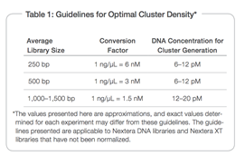

#### Library Pooling, Quantification, and Normalization

This step requires three parts:

    Part I: Pool libraries

    Part II: Quantification of fragment size and concentration to determine library concentration in nM

    Part III: Diluting your final library in Resuspension Buffer (RSB) or fresh 10 mM Tris pH 8.5 to a 4 nM solution.

**Part I:** Pooling

Aliquot 5 μl of diluted DNA from each library into a 1.5 microcentrifuge tube and mix aliquots for pooling libraries with unique indices. Depending on coverage needs, up to 384 libraries can be pooled for one MiSeq run.

**Part II:** Quanitification

Illumina recommends quantifying your libraries using a fluorometric quantification method that uses dsDNA binding dyes.

- In order to determine the fragment size, this laboratory adopted the Agilent D5000 ScreenTape System Quick Guide protocol from Agilent Technologies.
- In order to determine the library concentration, this laboratory adopted the Qubit® dsDNA HS Assay Kits protocol from Life Technologies.

DNA Concentration in nM

After determining the fragment size and concentration of your pooled product, you will calculate the DNA concentration in nM, based on the size of DNA amplicons as determined by an Agilent Technologies 2100 Bioanalyzer trace and concentration by Qubit:

.png)

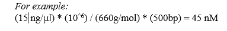

**Part II (continued): Procedure for determining fragment size**

Agilent Technologies Agilent D5000 ScreenTape System

This SOP format was adapted from the Agilent D5000 ScreenTape System Quick Guide [protocol](http://hpst.cz/sites/default/files/attachments/screentape-d5000-qg.pdf) from Agilent Technologies.

**Consumables:**

**Table 12.**  **TapeStation Consumables**

| Item | Quantity | Storage |
| --- | --- | --- |
| **Sample Buffer** | 10 μl per sample | 2° to 8°C |
| **D5000 Ladder** | 1 μl | 2° to 8°C |
| **ScreenTape** | Holds 16 samples per tape | 2° to 8°C |

Prepare TapeStation System D5000

**•** Launch the 2200 TapeStation Controller Software.

**•** Load single D5000 ScreenTape device and loading tips into the 2200 TapeStation instrument.

Sample Preparation D5000 ScreenTape Assay

1. Allow reagents to equilibrate at room temperature for 30 minutes.

2. Vortex mix before use.

3. Prepare ladder by mixing 10 μl D5000 Sample Buffer (green lid) with 1 μl D5000 Ladder (yellow lid) in a tube strip.

4. Prepare sample by mixing 10 μl D5000 Sample Buffer (green lid) with 1 μl DNA sample in different tube strips.

5. Spin down, then vortex using IKA vortexer and adaptor at 2000 rpm for 1 minute.

6. Spin down to position the sample at the bottom of the tube.

Sample Analysis

1. Load samples into the 2200 TapeStation instrument

2. Select the required samples on the 2200 TapeStation Controller Software.

3. Click Start and specify a filename with which to save your results.

**SAFE STOPPING POINT**

If you do not plan to proceed to _Part II Qubit Flurometer 3.0 dsDNA HS Assay_ on page _27_, leave your sample in 4°C.

**Part II (continued): Procedure for determining library concentration**

Qubit Fluorometer 3.0 dsDNA HS Assay

This SOP format was adapted from the Qubit® dsDNA HS Assay Kits [protocol](https://tools.thermofisher.com/content/sfs/manuals/Qubit_dsDNA_HS_Assay_UG.pdf)from Life Technologies.

Consumables

**Table 13.**  **Qubit 3.0 Fluorometer Consumables**

| Item | Quantity | Storage |
| --- | --- | --- |
| **Qubit dsDNA HS Buffer** | 199 μl per sample for working solution | Room temperature |
| **Qubit dsDNA HS Reagent** | 1 μl per 199 μl of HS Buffer | Room temperature |
| **Standard #1** | 10 μl per use | 2° to 8°C |
| **Standard #2** | 10 μl per use | 2° to 8°C |
| **Qubit™ Assay Tubes** | 1 per sample and 1 for each ladder | Room temperature |

Before you begin

• The final volume in each tube must be 200 μl.

• Each standard tube requires 190 μl of Qubit working solution + 10 μl of the standard

• Each sample tube requires anywhere from 180–199 μl + the corresponding volume to complete the necessary 200 μl

  - This laboratory uses 195 μl working solution + 5 μl of sample

• Careful pipetting is critical to ensure that the exact volume is added to the working solution—work SLOWLY

• Be sure to use a clean plastic tube each time you prepare Qubit working solution. Do not mix the working solution in a glass container

Procedure

Standard and Sample Preparation

1. Prepare the tubes:

    A. Set up two (2) 0.5-mL tubes for standards, and the required number of tubes for samples.

   Note Use only the thin-wall, clear, 0.5-mL PCR tubes (described in **Table 2** User‐Supplied Consumables)

   B. Label the tube lids- do not label the side of the tube as this could interfere with the sample read

2. Prepare the Qubit working solution:

    A. Prepare sufficient Qubit working solution to accommodate all standards and samples by diluting the Qubit dsDNA HS Reagent 1:200 in Qubit dsDNA HS Buffer.

    - 1 μl Qubit dsDNA HS Reagent + 199 μl Qubit dsDNA HS Buffer
    - For example, for 8 samples, prepare enough working solution for the samples and 2 standards: ~200 μl per tube in 10 tubes yields 2 mL of working solution (10 μl of Qubit reagent plus 1990 μl of Qubit buffer).

3. Prepare the standards:

   A. Add 190 μl of Qubit working solution to each of the tubes used for standards.

   B. Add 10 μl of each Qubit standard to the appropriate tube, then mix by vortexing 2–3 seconds. Be careful not to create bubbles.

4. Prepare the samples:

    A. Add Qubit working solution to individual assay tubes so that the final volume in each tube after adding the sample is 200 μl.

   **Note**: Your sample can be anywhere from 1–20 μl. Add a corresponding volume of Qubit working solution to each assay tube: anywhere from 180–199 μl.

   | Working Solution Volume | 199 μl | 195 μl | 190 μl | 185 μl | 180 μl |
   | --- | --- | --- | --- | --- | --- |
   | Sample Volume | 1 μl | 5 μl | 10 μl | 15 μl | 20 μl |

   B. Add each sample to the assay tubes containing the correct volume of Qubit working solution, then mix by vortexing 2–3 seconds. The final volume in each tube should be 200 μl.

5. Allow all tubes to incubate at room temperature for 2 minutes.

**Standard and Sample Reading**

1. On the home screen of the Qubit 3.0 Fluorometer, select " **dsDNA**", then " **High Sensitivity**", and then " **Read Standards**."

**Note** If you have already performed a calibration for the selected assay, the instrument prompts you to choose between reading new standards and running samples using the previous calibration. If you wish to use the previous calibration, disregard step 3 in the Standard and Sample Preparation step, and skip to step 4 below. Otherwise, continue with step 2 below.

2. Insert the tube containing Standard #1 into the sample chamber, close the lid, and then press **Read standard**. When the reading is complete (~3 seconds), remove Standard #1.

3. Insert the tube containing Standard #2 into the sample chamber, close the lid, and then press **Read standard**. When the reading is complete, remove Standard #2.

4. Press **Run samples**.

5. On the assay screen, select the sample volume and units using the + or – buttons on the wheel to select the sample volume added to the assay tube (from 1–20 μl).

6. From the dropdown menu, select the units for the output sample concentration (ng/ μl).

7. Insert a sample tube into the sample chamber, close the lid, and press Read tube. When the reading is complete (~3 seconds), remove the sample tube and repeat until all samples have been read.

**Part III: Normalization**

Dilute concentrated final library using Resuspension Buffer (RSB) or fresh 10 mM Tris pH 8.5 to **4 nM.**

Example:

Given a calculated concentration of 45nM, use C1V1=C2V2 to calculate how much RSB and sample to mix to create a 4nM concentration:

45nM (V1 )= 4nM (20 μl)

V1 = 1.78 μl of sample + 18.22 μl of RSB produces 20ul of a 4nM concentration

**SAFE STOPPING POINT**

If you do not plan to proceed to _Library Denaturing and MiSeq Sample Loading_, leave your sample in 4°C.

**Library Denaturing and MiSeq Sample Loading**

In preparation for cluster generation and sequencing, pooled libraries are denatured with NaOH, diluted with hybridization buffer, and then heat denatured before MiSeq sequencing. Each run must include a minimum of 5% PhiX to serve as an internal control for these low-diversity libraries. Illumina recommends using MiSeq v2 reagent kits for improved run metrics.

Consumables

**Table 14. Library Denaturing and Miseq Sample Loading Consumables**

| Item | Quantity | Storage |
| --- | --- | --- |
| **RSB (Resuspension Buffer)** | 6 μl | -15° to -25°C |
| **HT1 (Hybridization Buffer)** | 1540 μl | -15° to -25°C |
| **0.2 N NaOH (less than a week old)** | 10 μl | Room temperature |
| **200mM Tris-HCl pH7.0** | 5 μl | Room temperature |
| **PhiX Control Kit v3 (FC‐110‐3001)** | 2 μl | -15° to -25°C |
| **MiSeq v2 reagent cartridge** | 1 cartridge | -15° to -25°C |
| **1.7 ml microcentrifuge tubes (screw cap recommended)** | 3 tubes |
| **2.5 L ice bucket** |
 |
 
**Preparation**

1. Begin thawing the reagent cartridge and HT1 before denaturing and diluting libraries by placing them in a room temperature water bath for about an hour

    **A.** Once thawed, store the cartridge and HT1 in the ice bucket until ready for sample loading.

2. Obtain an ice bucket for your thawed cartridge, freshly made reagents, and sample.
3. Check pH of the stock 1.0N NaOH and the resulting 0.2N NaOH dilution using pH reader.

    **Note:** CO2 in the room will acidify NaOH over time. It is absolutely **critical** that the NaOH has a minimum pH \&gt;12.5.

4. Prepare a fresh dilution of 0.2 N NaOH [this is a critical step; NaOH must be prepared fresh every time]

    **a** Using a 1000ul pipette, measure out 800uL of laboratory-grade water.

    **b** In a separate microcentrifuge tube, measure 200uL of stock 1.0N NaOH.

    **c** Combine the two volumes and then invert several times to mix

        Note: This results in a 1mL of 0.2N NaOH solution; the resulting solution cannot be stored and must be used within 6 hours

        Note: The final concentration of NaOH cannot exceed 0.001 (1mM). Higher NaOH concentrations will inhibit library hybridization to the flow cell and result in very low cluster density.

5. If you have not already done so, prepare a 200mM stock of Tris-HCl pH7.0 by combining 800 μl of Laboratory-grade water and 200 μl of Tris-HCl 1M.

**Denature DNA**

1. Combine the following volumes of pooled final DNA library and freshly diluted 0.2 N NaOH in a microcentrifuge tube:

    • 4 nM pooled library (5 μl)

    • 0.2 N NaOH (5 μl)

2. Set aside the remaining dilution of 0.2 N NaOH to prepare a PhiX control within the next 12 hours.

3. Vortex briefly to mix the sample solution, and then centrifuge the sample solution at 280 × g (or about 1500rpm) at 20°C for 1 minute.

4.  Incubate for 5 minutes at room temperature to denature the DNA into single strands.

5. To the 10 μl of denatured library, add 5 μl of 200mM Tris-HCl pH7.0 to neutralize the NaOH.

6.  Add the following volume of pre‐chilled HT1 to the tube containing denatured DNA:

    • Denatured DNA + Tris-HCl (15 μl)

    • Pre‐chilled HT1 (985 μl)

    Adding the HT1 results in a 20 pM denatured library in 1 mM NaOH.

7. Place the denatured DNA on ice until you are ready to proceed to final dilution.

**Quick Review/Guide for denaturing 4nM library:**

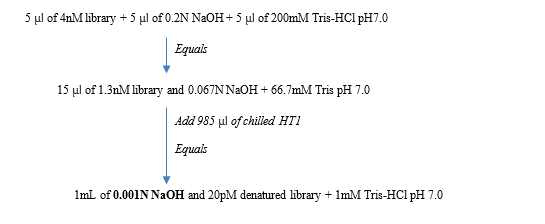

**NOTE: If you have to start with a lower concentration library, follow the below protocol for denaturing a 2nM library.**

**Quick Review/Guide for denaturing 2nM library:**

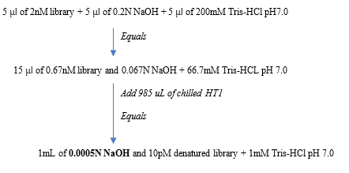

**Dilution chart for 10pM library:**

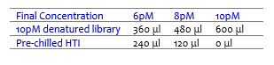

**Dilute Denatured DNA**

1. Dilute the denatured DNA to the desired concentration using the following example:

    **NOTE**

    Illumina recommends targeting 1000–1200 K/mm² raw cluster densities using MiSeq v2 reagents.

    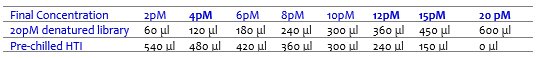

2. Invert several times to mix and then pulse centrifuge the DNA solution.

3. Place the denatured and diluted DNA on ice.

**Denature and Dilution of PhiX Control**

Use the following instructions to denature and dilute the 10 nM PhiX library to the same loading concentration as the Amplicon library. The final library mixture must contain at least 5% PhiX.

1. Combine the following volumes to dilute the PhiX library to 4 nM:

    • 10 nM PhiX library (2 μl)

    • RSB (3 μl)

3. Combine the following volumes of 4 nM PhiX and 0.2 N NaOH in a microcentrifuge tube:

    • 4 nM PhiX library (5 μl)

    • 0.2 N NaOH (5 μl)

3. Vortex briefly to mix the 2 nM PhiX library solution.

4. Incubate for 5 minutes at room temperature to denature the PhiX library into single strands.

5. To the 10 μl of denatured library, add 5 μl of 200mM Tris-HCl pH7.0 to neutralize the NaOH.

6. Add the following volumes of pre‐chilled HT1 to the tube containing denatured PhiX library to result in a 20 pM PhiX library:

    • Denatured PhiX library (15 μl)

    • Pre‐chilled HT1 (985 μl)

7. Dilute the denatured 20 pM PhiX library to the same loading concentration as the Amplicon library as follows.

    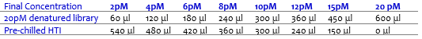

8. Invert several times to mix and then pulse centrifuge the DNA solution.

9. Place the denatured and diluted PhiX on ice.

**Combine Amplicon Library and PhiX Control**

    Note: The recommended PhiX control spike‐in of ≥ 5% for low diversity libraries is possible with RTA v1.17.28 or later, which is bundled with MCS v2.2. For optimal performance, update to v3 software (MCS 2.3). If you are using an older version of the MiSeq software or sequencing these libraries on the GA or HiSeq, Illumina recommends using ≥ 25% PhiX control spike‐in.

1. Combine the following volumes of denatured PhiX control library and your denatured amplicon library in a microcentrifuge tube, which results in a 5% spike-in of PhiX:

    • Denatured and diluted PhiX control (30 μl)

    • Denatured and diluted amplicon library (570 μl)

2. Set the combined sample library and PhiX control aside on ice until you are ready to load the mixture into the MiSeq v2 reagent cartridge.

3. Invert the tube 1–2 times to mix and load all 600ul into the designated well in the cartridge.

**Supporting Information**

The protocols described in this guide assume that you are familiar with the contents of this section and have obtained all of the requisite equipment and consumables.

Acronyms

**Table 15** Definitions and Acronyms

| Acronym | Definition |
| --- | --- |
| **PCR** | Polymerase Chain Reaction- a technique used to amplify 1 to a few copies of a piece of DNA across several orders of magnitude, generating thousands to millions of copies of a single DNA strand |
| **Primer** | A strand of short nucleic acid sequences that serves as a starting point for DNA synthesis during PCR |
| **Amplicon** | A piece of amplified DNA that is the product of a PCR reaction |

Dual Indexing Principle

The dual indexing strategy uses two 8 base indices, Index 1 (i7) adjacent to the P7 sequence, and Index 2 (i5) adjacent to the P5 sequence. Dual indexing is enabled by adding a unique Index 1 (i7) and Index 2 (i5) to each sample. The 96 sample Nextera XT Index Kit (FC‐131–1002) use 12 different Index 1 (i7) adapters (N701–N712) and 8 different Index 2 (i5) adapters (S501–S508). The 24 sample Nextera XT Index Kit (FC‐131–1001) uses 6 different Index 1 (i7) adapters (N701–N706) and 4 different Index 2 (i5) adapters (S501–S504). In the Index adapter name, the N or S refers to Nextera XT sample preparation, 7 or 5 refers to Index 1 (i7) or Index 2 (i5), respectively. The 01–12 refers to the Index number. A list of index sequences is provided for generating sample sheets to demultiplex the samples:

| _**Index 1 (i7)**_ |  **Sequence**  | **Index 2 (i5)** |  **Sequence** |
| --- | --- | --- | --- |
| N701 | TAAGGCGA | S501 | TAGATCGC |
| N702 | CGTACTAG | S502 | CTCTCTAT |
| N703 | AGGCAGAA | S503 | TATCCTCT |
| N704 | TCCTGAGC | S504 | AGAGTAGA |
| N705 | GGACTCCT | S505 | GTAAGGAG |
| N706 | TAGGCATG | S506 | ACTGCATA |
| N707 | CTCTCTAC | S507 | AAGGAGTA |
| N708 | CAGAGAGG | S508 | CTAAGCCT |
| N719 | GCTACGCT |
 |
 |
| N710 | CGAGGCTG |
 |
 |
| N711 | AAGAGGCA |
 |
 |
| N712 | GTAGAGGA |
 |
 |

**Supporting Information**

Low Plexity Pooling Guidelines

Illumina uses a green laser or LED to sequence G/T and a red laser or LED to sequence A/C. At each cycle, at least one of two nucleotides for each color channel are read to ensure proper registration. It is important to maintain color balance for each base of the index read being sequenced, otherwise index read sequencing could fail due to registration failure. If you choose the dual‐indexed sequencing workflow, always use at least two unique and compatible barcodes for each index (index 1 and index 2). The following tables illustrate possible pooling strategies:

**Table 16** Libraries Pooled: 6 or fewer; Sequencing Workflow: Single Index

| _Plex_ | _Index 1 (i7) Selection_ | _Index 2 (i5) Selection_ |
| --- | --- | --- |
| **1‐plex (no pooling)** | Any Index 1 adapter | Any Index 2 adapter |
| **2‐plex** | • [option 1] N702 and N701• [option 2] N702 and N704 |
| **3‐plex** | • [option 1] N701, N702, and N704• [option 2] N703, N705, and N706 |
| **4‐ or 5‐plex** | • [option 1] N701, N702, N704, and any other Index 1 adapter• [option 2] N703, N705, N706, and any other Index 1 adapter |
| **6‐plex** | N701, N702, N703, N704, N705, and N706 |

**Table 17** Sequencing Workflow: Single or Dual Index

| _Plex_ | _Index 1 (i7) Selection_ | _Index 2 (i5) Selection_ |
| --- | --- | --- |
| **7–12 plex, Dual Index** | • [option 1] N701, N702, N704, andany other Index 1 adapter (asneeded)• [option 2] N703, N705, N706, andany other Index 1 adapter (asneeded) | • [option 1] S501 and S502• [option 2] S503 and S504• [option 3] S505 and S506 |
| **7–12 plex, Single Index (96 sample****Nextera Index adapter kit)** | • N701–N706 and any other Index 1adapter (as needed) | • Any Index 2 (i5) adapter |
| **Greater than 12‐plex** | N701, N702, N703, N704, N705,N706, and any other Index 1 adapter | • [option 1] S501, S502, and anyother Index 2 adapter (as needed)• [option 2] S503, S504, and anyother Index 2 adapter (as needed)• [option 3] S505, S506, and anyother Index 2 adapter (as needed) |

These strategies represent only some of the acceptable combinations. Alternatively, check the real sequences of each index in the tables to make sure that each base position has a signal in both color channels for the index read:

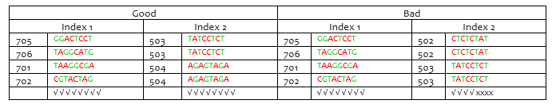

√=signal in both color

x=signal missing in one color channel

**Prevent PCR Product Contamination**

The PCR process is commonly used in the laboratory to amplify specific DNA sequences. Unless proper laboratory hygiene is used, PCR products can contaminate reagents, instrumentation, and genomic DNA samples, causing inaccurate and unreliable results. PCR product contamination can shut down lab processes and significantly delay normal operations.

Make sure that the lab is set up appropriately to reduce the risk of PCR product contamination:

    Physically Separate Pre-PCR and Post-PCR Areas

        • Physically separate laboratory space where pre‐PCR processes are performed (DNA extraction, quantification, and normalization) from the laboratory space where PCR products are made and processed (post‐PCR processes).

        • Never use the same sink to wash pre‐PCR and post‐PCR troughs.

        • Never share water purification systems for pre‐PCR and post‐PCR processes.

        • Store all supplies used in the protocols in the pre‐PCR area, and transfer to the post‐ PCR area as needed.

    Use Dedicated Equipment and Supplies 

        • Dedicate separate full sets of equipment and supplies (pipettes, centrifuges, oven, heat block, etc.) to pre‐PCR and post‐PCR lab processes, and never share between processes.

        • Dedicate separate storage areas (freezers and refrigerators) to pre‐PCR and post‐PCR consumables.

Because the pre‐ and post‐amplification reagents are shipped together, it is important to unpack the reagents in the pre‐PCR lab area. After unpacking the reagents, move the post-amplification reagents to the proper post‐PCR storage area.

**Pre‐PCR and Post‐PCR Lab Procedures**

To prevent PCR product contamination, it is important to establish lab procedures and follow best practices. Illumina recommends daily and weekly cleaning of lab areas using 0.5% Sodium Hypochlorite (10% Bleach).

    CAUTION

    To prevent sample or reagent degradation, make sure that all vapors from the cleaning solution have fully dissipated before beginning any processes.

**Daily Cleaning of Pre‐PCR Area**

A daily cleaning of the pre‐PCR area using a 0.5% Sodium Hypochlorite (10% Bleach) solution helps to eliminate PCR product that has entered the pre‐PCR area. Identify pre‐PCR areas that pose the highest risk of contamination, and clean these areas with a 0.5% Sodium Hypochlorite (10% Bleach) solution before beginning any pre‐PCR processes. High‐risk areas might include, but are not limited to, the following items:

      • Benchtops

      • Door handles

      • Refrigerator/freezer door handles

      • Computer mouse

      • Keyboards

**Daily Cleaning of Post‐PCR Area**

Reducing the amount of PCR product in the post‐PCR area helps reduce the risk of contamination in the pre‐PCR area. Daily cleaning of the post‐PCR area using a 0.5% Sodium Hypochlorite (10% Bleach) solution helps reduce the risk of contamination. Identify post‐PCR areas that pose the highest risk of contamination, and clean these areas with a 0.5% Sodium Hypochlorite (10% Bleach) solution daily. High‐risk areas might include, but are not limited to, the following items:

      • Thermal cyclers

      • Bench space used to process amplified DNA

      • Door handles

      • Refrigerator/freezer door handles

      • Computer mouse

      • Keyboards

**Weekly Cleaning of All Lab Areas**

One time a week, perform a thorough cleaning of the pre‐PCR and post‐PCR areas using 0.5% Sodium Hypochlorite (10% Bleach).

      • Clean all benchtops and laboratory surfaces.

      • Clean all instruments that are not cleaned daily.

      • Thoroughly mop lab floors.

      • Make sure that personnel responsible for weekly cleaning are properly trained on prevention of PCR product contamination.

**Items Fallen to the Floor**

The floor is contaminated with PCR product transferred on the shoes of individuals coming from the post‐PCR area; therefore, anything falling to the floor must be treated as contaminated.

    • Disposable items that have fallen to the floor, such as empty tubes, pipette tips, gloves, lab coat hangers, must be discarded.

    • Non‐disposable items that have fallen to the floor, such as a pipette or an important sample container, must be immediately and thoroughly cleaned. Use a 0.5% Sodium Hypochlorite (10% Bleach) solution to remove PCR product contamination.

    • Clean any lab surface that has come in contact with the contaminated item. Individuals handling anything that has fallen to the floor, disposable or non‐disposable, must discard their lab gloves and put on a new pair.

**Best Practices**

When preparing libraries for sequencing, always adhere to good molecular biology practices. Read through the entire protocol before starting to make sure that all of the required materials are available and your equipment is programmed and ready to use.

    Handling Liquids

    Good liquid handling measures are essential, particularly when quantifying libraries or diluting concentrated libraries for making clusters.

        • Small differences in volumes (±0.5 μl) can sometimes cause large differences in cluster numbers (~100,000).

        • Small volume pipetting can be a source of potential error in protocols requiring the generation of standard curves, such as qPCR, or small but precise volumes, such as the Agilent Bioanalyzer.

        • If small volumes are unavoidable, use due diligence to make sure that pipettes are correctly calibrated.

        • Make sure that pipettes are not used at the volume extremes of their performance specifications.

        • Prepare the reagents for multiple samples simultaneously, to minimize pipetting errors, especially with small volume enzyme additions. As a result, pipette one time from the reagent tubes with a larger volume, rather than many times with small volumes. Aliquot to individual samples in a single pipetting movement to allow for standardization across multiple samples.

    Handling Magnetic Beads

    NOTE: Cleanup procedures have only been validated using the 96‐well plates and the magnetic stand specified in Tables 1 and 2. Comparable performance is not guaranteed when using a microcentrifuge tube or other formats, or other magnets.

        • Before use, allow the beads to come to room temperature.

        • Do not reuse beads. Always add fresh beads when performing these procedures.

        • Immediately before use, vortex the beads until they are well dispersed and the color of the liquid is homogeneous.

        • When pipetting beads, pipette slowly and dispense slowly due to the viscosity of the solution.

        • Take care to minimize bead loss, which can affect final yields.

        • Change the tips for each sample, unless specified otherwise.

        • Let the mixed samples incubate at room temperature for the time indicated in the protocol for maximum recovery.

        • When removing and discarding supernatant from the wells, use a single channel or multichannel pipette and take care not to disturb the beads

        • When aspirating the cleared solution from the reaction plate and wash step, it is important to keep the plate on the magnetic stand and not disturb the separated magnetic beads. Aspirate slowly to prevent the beads from sliding down the sides of the wells and into the pipette tips.

        • To prevent the carryover of beads after elution, approximately 2.5 μl of supernatant is left when the eluates are removed from the bead pellet.

        • Be sure to remove all of the ethanol from the bottom of the wells, as it can contain residual contaminants.

        • Keep the reaction plate on the magnetic stand and let it air‐dry at room temperature to prevent potential bead loss due to electrostatic forces. Allow for the complete evaporation of residual ethanol, because the presence of ethanol affects the performance of the subsequent reactions. Illumina recommends at least minutes drying time, but a longer drying time can be required. Remaining ethanol can be removed with a 10 μl pipette.

        • Avoid over drying the beads, which can impact final yields.

        • Do not scrape the beads from the edge of the well using the pipette tip.

        • To maximize sample recovery during elution, incubate the sample/bead mix for 2 minutes at room temperature before placing the samples onto the magnet.

**Avoiding Cross‐Contamination**

Practice the following to avoid cross‐contamination:

    • Open only one adapter tube at a time.

    • Change the tips for each sample, unless specified otherwise.

    • Pipette carefully to avoid spillage.

    • Clean pipettes and change gloves between handling different adapter stocks.

    • Clean work surfaces thoroughly before and after the procedure.

**Potential DNA Contaminants**

When handling and processing samples using this protocol, use best practices to avoid PCR contamination, as you would when preparing PCR amplicons.

**Temperature Considerations**

Temperature is an important consideration for making libraries:

    • Keep libraries at temperatures ≤37°C, except where specifically noted.

    • Place reagents on ice after thawing at room temperature.

**Equipment**

    • Review the programming instructions for your thermal cycler user guide to make sure that it is programmed appropriately using the heated lid function.

    • It is acceptable to use the thermal cycler tracked heating lid function.

